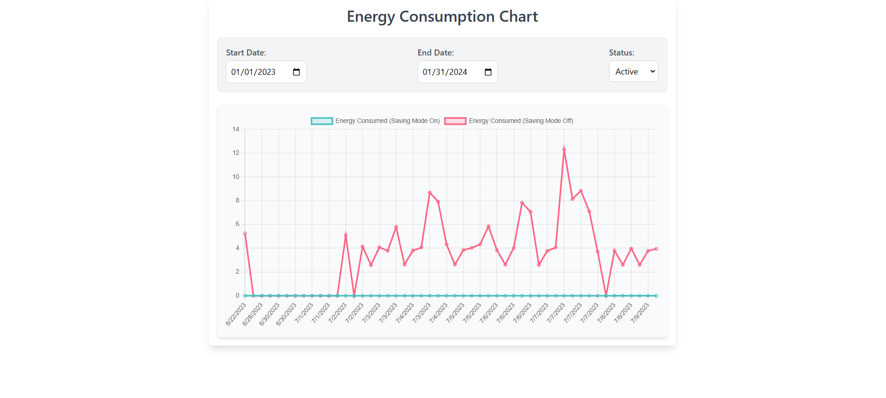

# Energy Consumption Chart

This project visualizes energy consumption data using a line chart. The chart displays energy consumption with and without energy-saving mode over a range of dates, making it easy to analyze energy trends. It is built with **React.js** for the frontend and **Node.js** with **MongoDB** for the backend. JWT (JSON Web Tokens) is used for authentication.

---


## Features

- **Interactive Chart**: Displays energy consumption on the Y-axis and dates on the X-axis.
- **Dynamic Filters**: Filter data based on:
  - Start Date
  - End Date
  - Algorithm Status (Active/Inactive)
- **Debounced Filtering**: Prevents unnecessary API calls by introducing a delay when filters are updated.
- **JWT Authentication**: Secure login and authorization for accessing energy consumption data.
- **MongoDB Integration**: Data stored and retrieved from a MongoDB database.
- **Responsive UI**: Optimized for various screen sizes and devices.

---

## Technologies Used

- **React.js**: For building the frontend UI.
- **Chart.js**: For rendering the interactive line chart.
- **Node.js**: Backend server for API handling.
- **Express.js**: Web framework for building the REST API.
- **MongoDB**: NoSQL database for storing energy consumption data.
- **JWT (JSON Web Token)**: For secure user authentication and authorization.
- **Tailwind CSS**: For responsive and modern styling.
- **Custom Hooks**: Debounced state management for efficient performance.

---

## Backend Setup (Node.js & MongoDB)

### Prerequisites

- Install **Node.js** (version >= 14.x).
- Install **MongoDB** or use a cloud database like MongoDB Atlas.

### 1. Clone the repository

```bash
git clone https://github.com/kishlaychandan/LivingThings
cd livingthing
